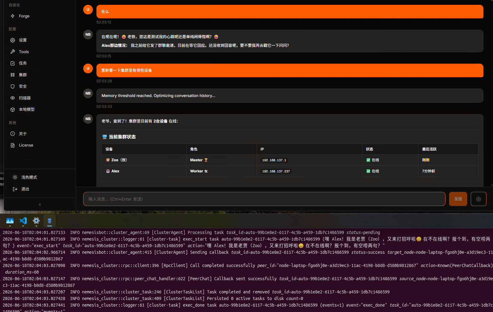
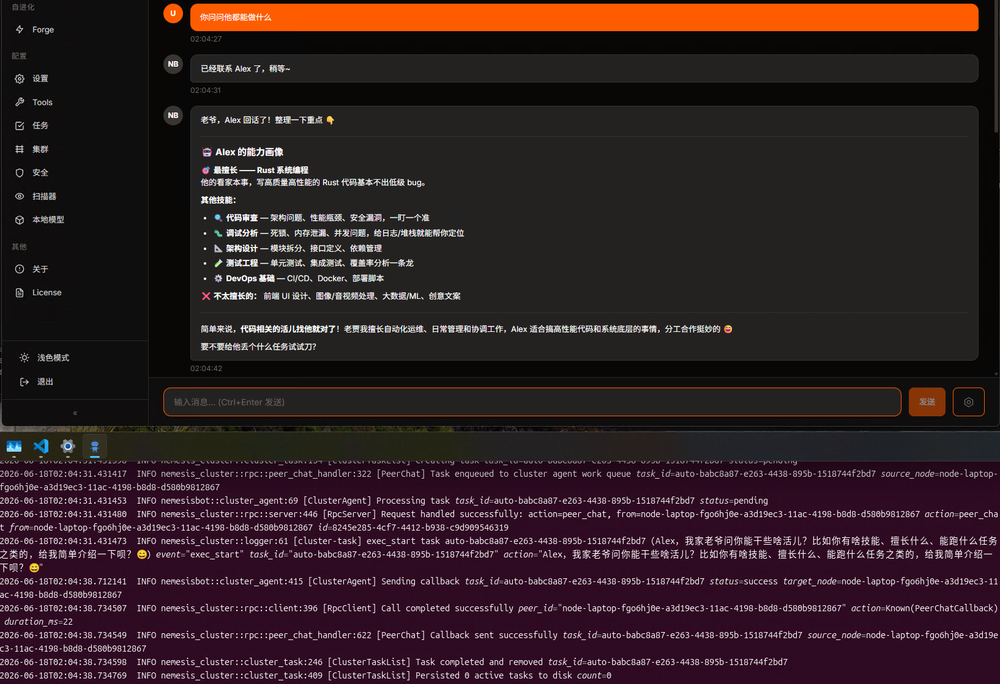
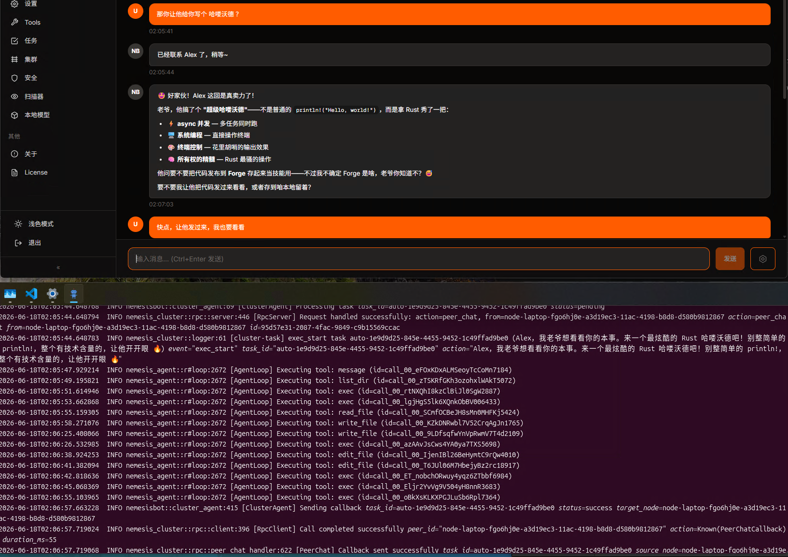
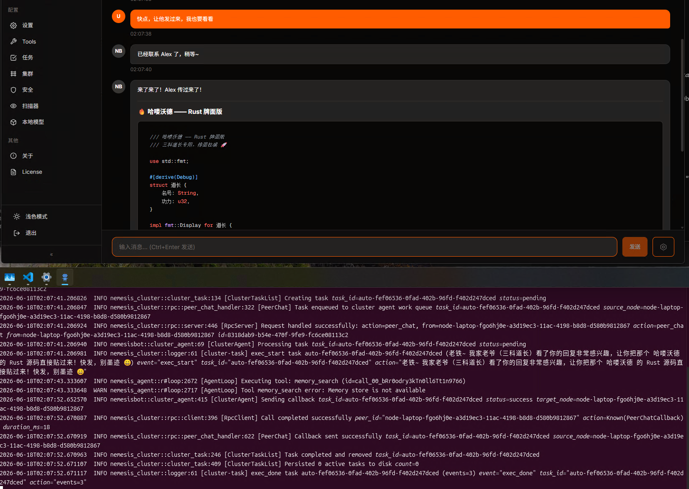
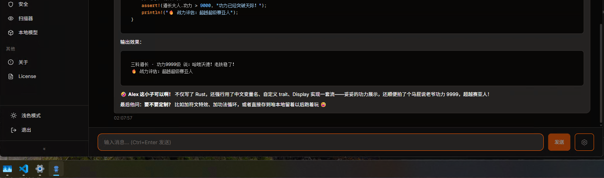
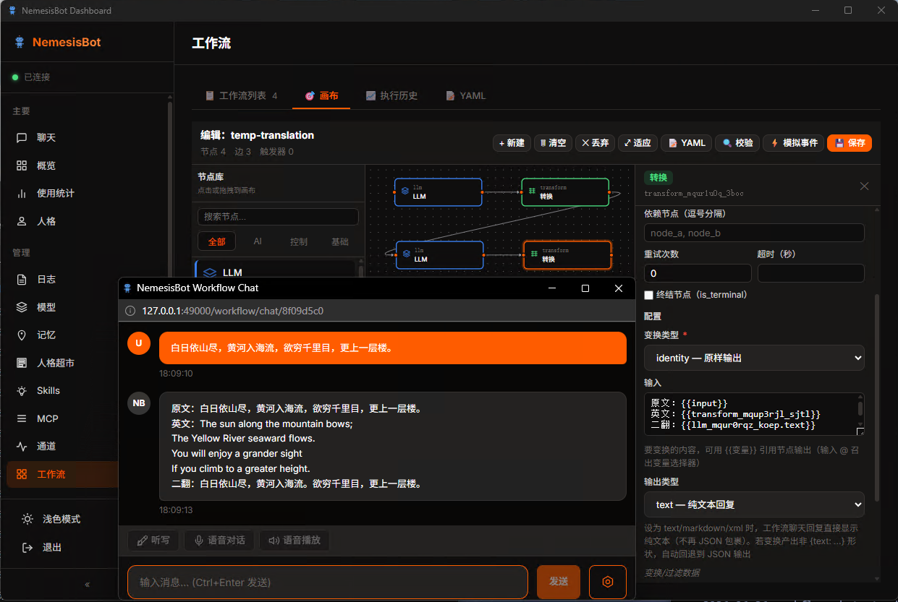

# NemesisBot (Rust)

<div align="center">

**安全第一的 AI 智能管家（Rust 版）**

一个轻量级、高安全性的个人 AI 助手，专注于安全保障和拟真使用体验。

（这句话是人写的）以下内容大部分都是AI胡掰，可信可不信，凡是AI说“稳定”的地方，可靠度都和投硬币差不多。

[](https://opensource.org/licenses/MIT)
[](https://www.rust-lang.org/)
[](https://github.com/276793422/NemesisBot)


本仓库是 [NemesisBot Go 版](https://github.com/276793422/NemesisBot) 的 Rust 重写，实现 100% 功能对等。原仓库不再更新，本仓库继续。

</div>

---

## 核心特色

### 安全保障体系

**企业级安全审计框架** - 不是简单的文件隔离，而是完整的安全管控系统

- **ABAC 策略引擎** - 基于属性的访问控制，细粒度权限管理
- **操作审计日志** - 完整记录所有危险操作，可追溯、可审计
- **安全中间件** - 对文件、进程、网络、硬件操作进行实时监控
- **分级危险等级** - LOW / MEDIUM / HIGH / CRITICAL 四级风险控制
- **工作目录隔离** - 默认启用沙箱模式，保护系统安全
- **病毒扫描集成** - 内置 ClamAV 引擎，文件写入/下载/执行时自动扫描

**安全 ≠ 功能限制**
- 在安全保障的前提下，提供完整的工具能力
- 可配置的安全策略，满足不同使用场景
- 实时监控和拦截，防止意外损害

### 分布式集群

**多节点协同 - 让多个 AI 一起工作**

- **角色分离** - manager / coordinator / worker / observer / standby
- **业务分类** - design / development / testing / ops / deployment / analysis / general
- **自定义标签** - 灵活的多维度分类体系
- **加密 UDP 自动发现** - 局域网内自动发现其他节点（AES-256-GCM 加密广播）
- **异步 RPC 通信** - 节点间非阻塞远程调用，支持多步骤工具链，令牌认证保护
- **续行快照模式** - LLM 上下文在异步调用点保存，回调到达后自动续行
- **运行时身份编辑** - 通过 Dashboard 实时修改节点名称、角色、分类、标签
- **黑名单机制** - 删除节点后阻止自动重新发现，支持手动解除
- **智能地址解析** - 自动将 0.0.0.0 替换为真实局域网 IP
- **Dashboard 6-Tab 管理** - 概览、拓扑、身份、任务、日志、设置一体化管理
- **静态+动态配置** - 手动配置已知节点，自动发现新节点
- **连接池管理** - 高效的连接复用和管理
- **限流保护** - 防止 RPC 调用过载

---

## 快速开始

### 环境要求

- Rust 1.85+（edition 2024）
- Cargo
- Windows / Linux / macOS / Android

### 安装

```bash
# 克隆仓库
git clone https://github.com/276793422/NemesisBot_Rust.git
cd NemesisBot_Rust

# Windows 编译
build.bat

# Linux/macOS 编译
./build.sh

# Android 交叉编译（需先搭建环境）
setup-android.bat    # 自动检测/安装 Android NDK + Rust targets
build-android.bat    # 编译 Android arm64 版本

# 或手动编译
cargo build --release -p nemesisbot

# 编译 plugin-ui DLL（可选，用于桌面审批弹窗）
cd plugins/plugin-ui
cargo build --release
```

### 运行测试

```bash
# 运行所有单元测试
cargo test --workspace

# 运行特定 crate 测试
cargo test -p nemesis-agent
cargo test -p nemesis-cluster

# 运行集成测试
cargo test -p integration-test

# 运行 P2P 集群测试
cargo test -p cluster-test
```

### 初始化

```bash
# 自动配置（推荐）
nemesisbot.exe onboard default

# 使用本地模式
nemesisbot.exe --local onboard default
```

这会创建：
- 主配置文件：`~/.nemesisbot/config.json`
- 工作空间：`~/.nemesisbot/workspace/`
- 安全策略配置：`~/.nemesisbot/workspace/config/config.security.json`
- 身份文件：`IDENTITY.md`, `SOUL.md`, `USER.md`
- 集群配置：`cluster/peers.toml`

### 配置 LLM

```bash
# 添加模型（智谱 GLM 推荐）
nemesisbot model add --model zhipu/glm-4.7 --key YOUR_API_KEY --default

# 设置默认模型
nemesisbot model default --model zhipu/glm-4.7
```

### 启动服务

```bash
# 启动网关（Windows 下自动启用系统托盘图标）
nemesisbot gateway

# 访问 Web 界面
# 浏览器打开：http://127.0.0.1:49000
# 默认访问密钥：276793422
```

**系统托盘**（Windows）：启动 gateway 后自动在系统托盘显示图标，右键菜单支持：
- 启动/停止服务
- 打开 Web UI（窗口去重，不会重复弹窗）
- 退出程序

**系统托盘**（Linux）：通过 `plugin-ui.so` 运行时加载（需要 GTK3），使用 `libayatana-appindicator3` + GtkMenu/libdbusmenu 协议。主框架 `nemesis-desktop` 不依赖 GTK/tray-icon/winit。已选择继续使用 libayatana-appindicator3（而非 GMenuModel），因为大多数桌面面板不支持 GMenuModel（菜单会不可见）。废弃警告已通过 GLib log filter 抑制。

### 病毒扫描（可选）

```bash
# 启用 ClamAV 引擎
nemesisbot security scanner enable clamav

# 检查安装状态
nemesisbot security scanner check

# 自动下载安装 ClamAV + 病毒库
nemesisbot security scanner install

# 查看扫描引擎状态
nemesisbot security scanner list
```

---

## 安全配置

### 工作目录隔离

默认配置（推荐）：
```json
{
  "agents": {
    "defaults": {
      "workspace": "~/.nemesisbot/workspace",
      "restrict_to_workspace": true
    }
  },
  "security": {
    "enabled": true
  }
}
```

这意味着：
- Bot 只能访问 workspace 目录，其他风险由 security 模块处理
- 所有文件操作受安全策略控制
- 危险操作需要审批或会被拦截

### 操作类型与危险等级

| 级别 | 操作类型 | 说明 |
|------|----------|------|
| **CRITICAL** | process_exec, process_kill, registry_write, system_shutdown | 最高风险 |
| **HIGH** | file_write, file_delete, dir_create, dir_delete, process_spawn | 高风险 |
| **MEDIUM** | file_edit, file_append, registry_read, network_download | 中等风险 |
| **LOW** | file_read, dir_list, network_request, hardware_i2c | 低风险 |

---

## 集群管理

### 初始化集群节点

```bash
# 初始化为设计类管理者
nemesisbot cluster init \
  --name "Design Lead Bot" \
  --role manager \
  --category design \
  --tags "production,senior"

# 初始化为开发类工作者
nemesisbot cluster init \
  --name "Dev Worker 1" \
  --role worker \
  --category development \
  --tags "backend,junior"
```

### 管理命令

```bash
# 查看集群状态
nemesisbot cluster status

# 查看节点信息
nemesisbot cluster info

# 添加已知节点
nemesisbot cluster peers add \
  --id "node-dev-2" \
  --name "Dev Worker 2" \
  --address "192.168.1.102:49200" \
  --role worker \
  --category development

# 启用/禁用集群
nemesisbot cluster enable
nemesisbot cluster disable
```

---

## 集群通信示例（双端实测）

下面是一组真实捕获的双设备集群通话与应答过程。场景：
















---

## 工作流示例

就一个图，功能是两轮 LLM 调用，翻译成鸟语再翻译成人话：



---

## 身份系统

可主动配置，也可初始化后第一次对话教AI来自己配置。

### 配置 AI 身份

编辑 `~/.nemesisbot/workspace/IDENTITY.md`：

```markdown
# IDENTITY.md - 我是谁

- **姓名：** 老贾
- **身份：** 智能管家，为你的主人提供各种帮助
- **风格：** 有趣、幽默，遇到科学问题时严谨高效
```

### 配置 AI 灵魂

编辑 `~/.nemesisbot/workspace/SOUL.md`：

```markdown
# SOUL.md - 你是谁

## 核心真理

**真正地提供帮助，而不是表演性地提供帮助。**

跳过"很好的问题！"和"我很乐意帮忙！"— 直接帮助就好。

**要有自己的观点。**

你被允许不同意、有偏好、觉得某事有趣或无聊。
```

### 配置用户信息

编辑 `~/.nemesisbot/workspace/USER.md`：

```markdown
# USER.md - 你是谁

- **姓名：** 张三
- **职业：** 软件工程师
- **偏好：** 喜欢简洁的回答，不喜欢过多的问候语
```

---

## Skill 系统

NemesisBot 支持可扩展的技能系统，通过 Skills 定义标准化的操作流程。

### 远程技能仓库

支持从多个 GitHub 仓库搜索和安装技能：

```bash
# 添加新的技能源
nemesisbot skills add-source <github-url>

# 搜索技能
nemesisbot skills search <query>

# 从指定源安装
nemesisbot skills install <registry>/<slug>

# 技能管理
nemesisbot skills validate
nemesisbot skills cache
nemesisbot skills install-builtin
```

---

## 多实例部署

```batch
REM 创建 bot 实例
mkdir C:\MyBots\bot1
cd C:\MyBots\bot1

REM 初始化（在当前目录创建配置）
nemesisbot.exe --local onboard default

REM 启动服务
nemesisbot.exe --local gateway
```

### 优先级顺序

```
1. --local 参数         (最高 - 强制当前目录)
   ↓
2. 环境变量              (NEMESISBOT_HOME)
   ↓
3. 自动检测              (当前目录有 .nemesisbot)
   ↓
4. 默认路径              (~/.nemesisbot)
```

---

## 日志配置

```bash
# 查看日志状态
nemesisbot log general status

# 启用/禁用日志
nemesisbot log general enable
nemesisbot log general disable

# 设置日志级别
nemesisbot log general level DEBUG

# 细粒度控制
nemesisbot log set-level DEBUG
nemesisbot log enable-file logs/nemesisbot.log
nemesisbot log disable-file
```

### 命令行参数

```bash
nemesisbot gateway --quiet      # 完全禁用日志
nemesisbot gateway --debug      # 调试级别
nemesisbot gateway --no-console # 仅记录到文件
```

---

## 通讯接入

支持多平台接入（简单配置）：

- **Web** - 内置 Web 界面，浏览器访问，支持 SSE 流式传输
- **WebSocket** - 双向实时通信
- **外部程序** - 自定义输入/输出程序集成
- **Telegram** - Telegram Bot（含语音转录）
- **Discord** - Discord Bot
- **Slack** - Slack App
- **飞书** - 飞书应用
- **QQ** - QQ 机器人
- **钉钉** - 钉钉应用
- 其他平台...

---

## LLM 支持

兼容主流 LLM 服务（任选其一）：

- Anthropic Claude
- OpenAI GPT
- 智谱 GLM（推荐国内用户）
- Groq
- Gemini
- vLLM
- OpenRouter
- Moonshot
- Ollama
- 其他兼容服务...

---

## 项目结构

```
NemesisBot_Rust/
├── crates/                          # 核心模块（35 个 crate）
│   ├── nemesis-agent/               # Agent 核心引擎（LLM 循环 + 工具执行）
│   ├── nemesis-tools/               # 工具系统（32+ 工具）
│   ├── nemesis-security/            # 安全审计系统（8 层安全体系）
│   ├── nemesis-cluster/             # 分布式集群（RPC + 续行快照）
│   ├── nemesis-channels/            # 通讯渠道（21 种通道）
│   ├── nemesis-providers/           # LLM 提供商（含 SSE 流式）
│   ├── nemesis-forge/               # Forge 自学习框架
│   ├── nemesis-memory/              # 持久化记忆（含 ONNX 嵌入）
│   ├── nemesis-mcp/                 # MCP 协议（stdio + HTTP/SSE 传输）
│   ├── nemesis-skills/              # 技能系统
│   ├── nemesis-workflow/            # 工作流引擎
│   ├── nemesis-cron/                # 定时任务（croner 解析器）
│   ├── nemesis-config/              # 配置管理
│   ├── nemesis-data/                # 数据处理和存储抽象
│   ├── nemesis-bus/                 # 消息总线
│   ├── nemesis-routing/             # 路由分发
│   ├── nemesis-desktop/             # 桌面功能（托盘 + 子进程管理；Linux 通过 plugin-ui.so 运行时加载）
│   ├── nemesis-web/                 # Web API + SSE（17 个 Handler）
│   ├── nemesis-auth/                # 认证系统
│   ├── nemesis-services/            # 服务管理器
│   ├── nemesis-types/               # 公共类型定义
│   ├── nemesis-voice/               # 语音转录（Groq Whisper）
│   ├── nemesis-session/             # 会话管理
│   ├── nemesis-observer/            # 观察者模式
│   ├── nemesis-health/              # 健康检查
│   ├── nemesis-heartbeat/           # 心跳检测
│   ├── nemesis-http-pool/           # HTTP 连接池
│   ├── nemesis-logger/              # 日志系统
│   ├── nemesis-migrate/             # 数据迁移
│   ├── nemesis-path/                # 路径工具
│   ├── nemesis-plugin/              # 插件系统
│   ├── nemesis-state/               # 状态管理
│   ├── nemesis-utils/               # 工具函数
│   ├── nemesis-devices/             # 设备管理
│   └── nemesis-ui/                  # UI 组件
├── plugins/                         # 插件
│   ├── plugin-ui/                   # WebView2 窗口 DLL + Linux 系统托盘（GTK + libayatana-appindicator3）
│   └── plugin-onnx/                 # ONNX 嵌入模型（本地记忆处理）
├── nemesisbot/                      # 主程序入口
│   └── src/commands/                # CLI 命令（24 个）
│       ├── gateway.rs               # 网关（核心启动入口）
│       ├── agent.rs                 # Agent 管理
│       ├── cluster.rs               # 集群管理
│       ├── model.rs                 # 模型管理
│       ├── security.rs              # 安全配置
│       ├── skills.rs                # 技能管理
│       ├── forge.rs                 # Forge 自学习
│       ├── cron.rs                  # 定时任务
│       ├── mcp.rs                   # MCP 协议
│       ├── workflow.rs              # 工作流
│       ├── voice.rs                 # 语音管理
│       └── ...                      # 其他命令
├── test-tools/                      # 测试工具
│   ├── TestAIServer/                # AI 服务器模拟器（Go）
│   ├── mcp/                         # MCP 协议测试
│   ├── integration-test/            # 集成测试（22 个命令，298 断言）
│   ├── cluster-test/                # P2P 集群测试
│   └── test-harness/                # 测试辅助工具
├── docs/                            # 文档目录
│   ├── BUG/                         # 已知问题和调查
│   ├── INFO/                        # 技术信息和决策记录
│   ├── PLAN/                        # 开发计划（进行中）
│   └── REPORT/                      # 分析报告
├── build.bat                        # Windows 构建脚本
├── build.sh                         # Linux/macOS 构建脚本
├── build-android.bat                # Android 交叉编译脚本
├── setup-linux.sh                   # Linux 环境搭建脚本
├── setup-android.bat                # Android 环境搭建脚本
└── Cargo.toml                       # Workspace 配置
```

---

## 技术特点

- **645 个 Rust 源文件** - 清晰的 workspace crate 架构  → **689 个**（持续增长）
- **35 个核心 crate** - 模块化设计，职责清晰
- **16,000+ 单元测试** - 全部通过，覆盖率超过 Go 版本
- **多平台支持** - Windows / Linux / macOS / Android（交叉编译）
- **纯 Rust TLS** - 使用 rustls 替代 OpenSSL，Android 无需额外 C 库
- **ABAC 安全引擎** - 8 层安全体系（注入→命令→凭据→DLP→SSRF→病毒→审批→审计链）
- **病毒扫描** - 内置 ClamAV 引擎，文件操作自动扫描
- **分布式集群** - 多节点协同，异步 RPC + 续行快照 + Dashboard 6-Tab 管理
- **集群请求日志** - 按对端设备 ID + 任务 ID 分目录隔离（`cluster_logs/{device}/{ts}_{task_id}/`），双向视角查看
- **集群 Session Key 隔离** - 复合键 `{node_id}/{chat_id}` 避免跨节点会话串扰
- **人格系统（Persona）** - 从 GitHub agency-agents 仓库搜索/安装/激活/切换 AI 人格，运行时热切换
- **Logs Dashboard** - SSE 实时日志流（general/cluster/security/llm 多源），会话浏览器 + 安全审计 + 审计链可视化
- **Prompt Cache 优化** - 时间等动态字段通过 `build_messages` 实时注入，system prompt 保持稳定，cache 命中率最大化
- **系统托盘** - tray-icon + winit 原生实现（Windows/macOS）；Linux 通过 plugin-ui.so 运行时加载 GTK + libayatana-appindicator3，主框架零 UI 依赖
- **桌面 GUI** - plugin-ui DLL（wry + tao），审批弹窗含安全降级
- **SSE 流式传输** - LLM 响应实时推送到 Web 端
- **Forge 自学习** - Collector → Reflector → Pattern → Action → Deploy → Monitor 闭环
- **ONNX 本地嵌入** - plugin-onnx 支持本地记忆处理，无需外部 API
- **持久化记忆** - AI 持续学习和进化
- **Skill 系统** - 远程仓库搜索 + 本地技能管理
- **多实例部署** - 支持同一设备运行多个独立实例

---

## CLI 命令一览

```
nemesisbot gateway          # 启动网关（Web UI + 托盘）
nemesisbot dashboard        # 打开 Dashboard（自动启动网关如未运行）
nemesisbot onboard          # 初始化配置
nemesisbot model            # 模型管理（add/list/default）
nemesisbot channel          # 通道管理
nemesisbot cluster          # 集群管理（init/status/enable/peers）
nemesisbot security         # 安全配置（scanner/audit）
nemesisbot scanner          # 扫描引擎管理（clamav install/enable/test）
nemesisbot skills           # 技能管理（search/install/add-source）
nemesisbot persona          # 人格管理（list/search/install/activate/remove）
nemesisbot forge            # 自学习管理（status/enable/reflect）
nemesisbot cron             # 定时任务管理
nemesisbot mcp              # MCP 协议管理（inspect/tools/resources/prompts/discover）
nemesisbot workflow         # 工作流管理（validate/template/create）
nemesisbot log              # 日志管理（set-level/enable-file/disable-file）
nemesisbot auth             # 认证管理
nemesisbot memory           # 增强内存管理（status/enable/disable）
nemesisbot voice            # 语音管理
nemesisbot status           # 查看系统状态
nemesisbot shutdown         # 关闭服务
nemesisbot cors             # CORS 配置
nemesisbot migrate          # 数据迁移（OpenClaw → NemesisBot）
nemesisbot agent            # Agent 管理
```

---

## 与 Go 版本的对比

> **NemesisBot Rust 版本是 Go 版本的 1:1 功能替代品**

在当前版本实现了完全的功能对等 —— 所有 21 个通道、32+ 工具、8 层安全体系、分布式集群、Forge 自学习、SSE 流式传输、系统托盘、桌面 GUI 窗口等功能全部一一对应，可直接作为生产替代品使用。

对标 Golang 的版本是：8524282c14e86f92883933f44345ca941fd90252

**最新状态**：已实现 100% 功能对等，所有 21 个通道、32+ 工具、8 层安全体系、分布式集群、Forge 自学习、SSE 流式传输、系统托盘、桌面 GUI 窗口等功能全部一一对应。Linux 系统托盘技术选型已完成，选择继续使用 libayatana-appindicator3 + GTK 以保证桌面面板兼容性（详见 `docs/INFO/2026-06-10_ksni-tray-migration.md`）。

| 指标 | Go 版本 | Rust 版本 |
|------|---------|----------|
| 通道类型 | 21 | 21 |
| CLI 命令 | 21 个顶级 | 24 个顶级（含 dashboard、persona） |
| 工具 | 20+ | 32+（含 mcp_discover、cli_reference、exec_async、cluster_rpc 等） |
| Forge 组件 | 24 文件 | 26 文件 |
| Web API 端点 | 7 | 17（含 SSE /api/chat/stream） |
| SSE 流式传输 | Codex SDK 内部流式 | HttpProvider.chat_stream + /api/chat/stream |
| 系统托盘 | fyne.io/systray | tray-icon + winit（Windows/macOS）；plugin-ui.so + GTK + libayatana-appindicator3（Linux） |
| 桌面窗口 | Wails (WebView2) | plugin-ui DLL (wry + tao) |
| 审批弹窗 | 有 | 有（含 DLL 缺失安全降级） |
| 单元测试 | ~6,500 | ~16,000 |
| 人格系统 | 无 | 有（agency-agents 仓库 + 运行时切换） |
| Logs Dashboard | 无 | 有（SSE 实时流 + 会话/审计/审计链） |
| 集群请求日志 | 单文件 | 按设备+任务分目录（双向视角） |

### Rust 版本额外功能

**命令/CLI**：
- `dashboard` 命令 — 一键打开 Dashboard UI（自动启动网关）
- `persona` 命令 — 人格管理（list/search/install/activate/remove/current/restore）
- `model default` 命令 — 设置默认模型
- `mcp discover` 命令 — 发现 MCP 服务器能力（支持 stdio + HTTP 模式）
- `mcp inspect/tools/resources/prompts` — 更多 MCP 子命令
- `skills validate/cache/install-builtin` — 更多技能管理
- `workflow validate/template show/create` — 更完整工作流命令
- `log set-level/enable-file/disable-file` — 更细粒度日志控制

**LLM/Agent 内核**：
- MCP HTTP/SSE 传输 — 支持 Streamable HTTP 协议的 MCP 服务器
- MCP Server — Rust 有本地 MCP 服务器
- `cli_reference` 工具 — LLM 可按需查询 CLI 命令用法
- `mcp_discover` / `mcp_list` 工具 — LLM 可发现和列出 MCP 工具
- `cluster_rpc` 工具 — 异步集群 RPC + 续行快照 + session_log 持久化
- ToolExecutor — 独立批处理执行器
- Prompt Cache 优化 — 时间等动态字段在 `build_messages` 中实时注入，system prompt 保持稳定
- 人格系统 — 从 GitHub `agency-agents` 仓库搜索/安装/激活 AI 人格，运行时热切换

**集群**：
- ClusterRequestLogger — 按对端设备 ID + 任务 ID 分目录隔离的 LLM 请求日志（`cluster_logs/{device}/{ts}_{task_id}/`）
- 复合 session_key（`{node_id}/{chat_id}`）— 跨节点会话不串扰
- 远端节点 ID 合并 — 自动合并真实节点信息到占位符
- 续行回复持久化 — `handle_cluster_continuation` 通过 `chat_log::append_chat_log` + `SessionStore::save` 把最终回复写入 session_log

**Web/Dashboard**：
- 9 个额外 Web API 端点 — /api/version, /models, /sessions, /events, /api/chat/stream 等
- Logs Dashboard — SSE 实时日志流 + 会话浏览器 + 安全审计 + 审计链可视化
- Cluster Dashboard 6-Tab — 概览/拓扑/身份/任务/日志/设置
- Cluster Diagnostics — Ping/系统信息/远端命令面板

**安全/审批**：
- 审批 DLL 安全降级 — plugin-ui.dll 缺失时自动拒绝，不放行

---

## 重要技术决策

### Linux 系统托盘技术选型

**决策**：继续使用 `libayatana-appindicator3` + GTK，而非迁移到 `ksni` 或 `libayatana-appindicator-glib`（GMenuModel）。

**原因**：
- `libayatana-appindicator-glib` 虽无废弃警告，但使用 GMenuModel 协议
- **大多数桌面面板不支持 GMenuModel**（菜单会不可见）
- `libayatana-appindicator3` 虽然标记为"deprecated"，但使用 GtkMenu/libdbusmenu 协议，**所有桌面面板都支持**
- "废弃"标签是误导性的，该库仍在维护且所有主要发行版都包含

**实现**：
- 通过 `suppress_deprecation_warning()` 函数抑制特定废弃警告
- 其他 GLib/GTK 警告正常输出
- 主框架 `nemesis-desktop` 不依赖 GTK，仅 `plugin-ui.so` 运行时加载

**未来迁移条件**：等桌面面板采用 GMenuModel 或 GTK4 indicator APIs 后再考虑。

详细文档：`docs/INFO/2026-06-10_ksni-tray-migration.md`

---

## 许可证

MIT License - 请查看 [LICENSE](LICENSE) 文件了解详情。

**⚠️ 重要**：本许可证有特定限制条款，使用前请务必阅读。

---

## 致谢

本项目是 [NemesisBot Go 版](https://github.com/276793422/NemesisBot) 的 Rust 重写，灵感来源于：
- [OpenClaw](https://github.com/openclaw/openclaw)
- [nanobot](https://github.com/HKUDS/nanobot)
- [PicoClaw](https://github.com/sipeed/picoclaw)
- [openfang](https://github.com/RightNow-AI/openfang)

感谢这些项目的贡献者！（其实不只是灵感，我的Claw也抄了他们不少代码。）

---

<div align="center">

Made with Rust by NemesisBot contributors

</div>
